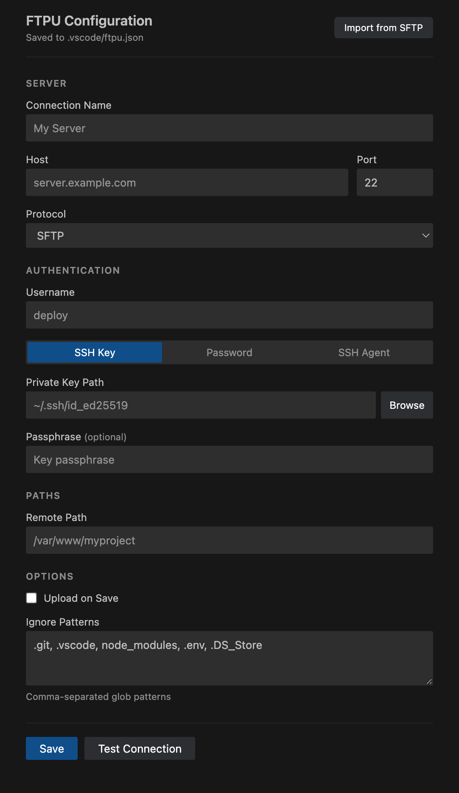

# FTPU — FTP Upload for VS Code

A lightweight, focused SFTP/FTP uploader for VS Code. FTPU tracks every file you change and gives you full control over what gets uploaded and when — no syncing, no downloading, no clutter.

Built for developers who edit locally and deploy to remote servers, especially useful when working with AI coding agents that modify many files across your project.



## Features

### Modified Files Tracking

FTPU automatically tracks every file you save or modify and displays them in a dedicated **Modified Files** panel in the Explorer sidebar. Each file shows its current state:

- **Pending** — changed locally, not yet uploaded
- **Uploading** — transfer in progress
- **Uploaded** — successfully sent to the server
- **Failed** — upload encountered an error

This is particularly valuable when working with AI coding assistants (Cursor, Claude Code, Copilot, etc.) that can modify dozens of files in a single session. Instead of trying to remember what changed, FTPU keeps a running list so you can review and upload everything at once when you're ready.

Files persist across VS Code restarts — if you close your editor mid-session, your pending uploads are still there when you come back.

### File Watcher Health Check

FTPU includes a built-in diagnostic that verifies your operating system's file watching capability on startup. macOS and Linux have a limited number of file watchers available system-wide, and when too many applications consume them, file change events stop being delivered — silently. Most extensions and tools simply stop working without telling you why.

FTPU actively tests whether file watching is functional by writing and observing a temporary file. If the system can't deliver file change events, FTPU warns you immediately and shows the watcher health status in the status bar:

- **Green** — file watcher is active, all external changes will be detected
- **Red** — file watcher is unavailable, typically resolved by restarting your machine
- **Yellow** — health check in progress

### Upload Modes

- **Manual** — files are tracked as you work, upload individually or all at once when ready
- **Upload on Save** — every save is automatically uploaded to the remote server

Toggle between modes with a single click on the status bar or via the command palette.

### Status Bar


The status bar gives you a persistent overview of your connection and upload state:

- Settings shortcut
- Connection status with server name
- Current upload mode (Auto/Manual)
- File watcher health indicator

Every element is interactive — click to connect, disconnect, toggle upload mode, or open settings.

### Configuration UI

FTPU provides a full graphical configuration panel — no need to hand-edit JSON. Access it via the command palette (`FTPU: Configure`) or the gear icon in the status bar.

- Server connection details (host, port, protocol)
- Authentication via SSH key, password, or SSH agent
- Remote path mapping
- Ignore patterns (glob-based)
- **Import from SFTP** — migrate your existing `sftp.json` configuration with one click

Configuration is stored in `.vscode/ftpu.json`, keeping it alongside your other workspace settings.

### Connection Management

- Supports **SFTP**, **FTP**, and **FTPS** protocols
- Automatic reconnection with configurable retry (up to 3 attempts with progressive backoff)
- Keepalive to prevent idle disconnections
- SSH key, password, and SSH agent authentication
- Connection test from the settings panel before committing to a configuration

### Explorer Integration

Right-click any file or folder in the VS Code Explorer to upload it directly. Folder uploads recursively send all files while respecting your ignore patterns.

### Ignore Patterns

Configure glob patterns to exclude files and directories from tracking and uploading. Defaults include `.git`, `.vscode`, `node_modules`, `.env`, and `.DS_Store`. The `.git` directory is always excluded regardless of configuration.

## Commands

All commands are available via the Command Palette (`Cmd+Shift+P` / `Ctrl+Shift+P`):

| Command | Description |
|---------|-------------|
| `FTPU: Configure` | Open the settings panel |
| `FTPU: Connect` | Connect to the remote server |
| `FTPU: Disconnect` | Disconnect from the server |
| `FTPU: Upload Current File` | Upload the active editor file |
| `FTPU: Upload All Modified` | Upload all pending files |
| `FTPU: Clear Modified List` | Clear the tracked files list |
| `FTPU: Toggle Upload on Save` | Switch between manual and auto upload |

## Getting Started

1. Open a project in VS Code
2. Run `FTPU: Configure` from the command palette
3. Enter your server details and save
4. Start editing — FTPU tracks your changes automatically
5. Upload individual files from the Modified Files panel, or hit **Upload All Modified** when ready

## Configuration

FTPU stores its configuration in `.vscode/ftpu.json`:

```json
{
    "name": "My Server",
    "protocol": "sftp",
    "host": "server.example.com",
    "port": 22,
    "username": "deploy",
    "privateKeyPath": "~/.ssh/id_ed25519",
    "remotePath": "/var/www/myproject",
    "uploadOnSave": false,
    "ignore": [".git", ".vscode", "node_modules", ".env", ".DS_Store"]
}
```

## Migrating from SFTP Extension

If you're coming from the popular SFTP extension, use the **Import from SFTP** button in the configuration panel. It reads your existing `.vscode/sftp.json` and maps the settings across automatically.

## License

MIT
